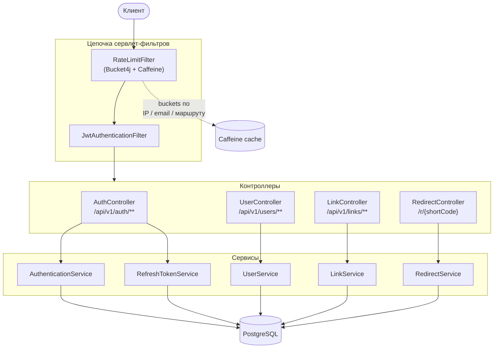
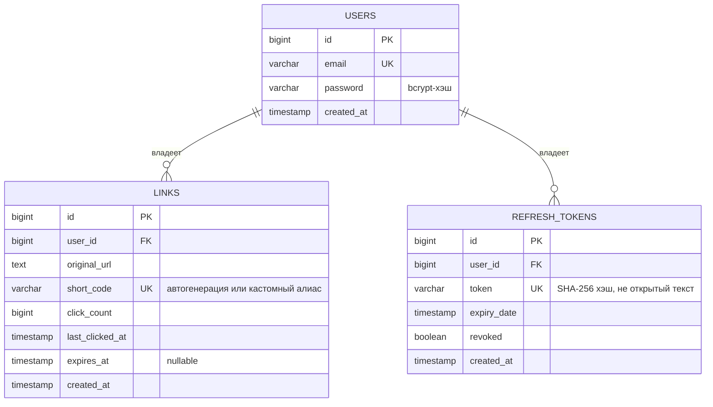
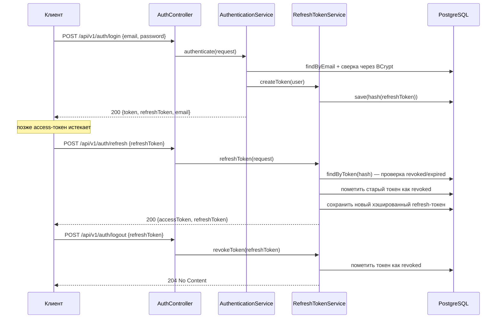
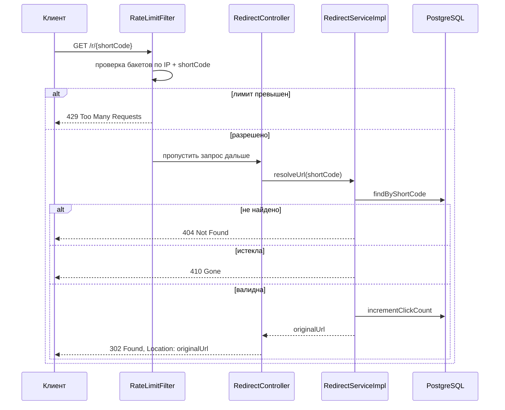

# URL Shortener

[](https://github.com/wintertempiq/urlshortener/actions/workflows/ci.yml)


Сервис для сокращения ссылок на Spring Boot, написанный в качестве pet-проекта.

---

## Содержание

- [Чем проект отличается от типового CRUD-демо](#чем-проект-отличается-от-типового-crud-демо)
- [Стек технологий](#стек-технологий)
- [Архитектура](#архитектура)
- [Модель данных (ER-диаграмма)](#модель-данных-er-диаграмма)
- [Поток аутентификации](#поток-аутентификации)
- [Поток редиректа](#поток-редиректа)
- [Rate limiting](#rate-limiting)
- [Быстрый старт](#быстрый-старт)
- [Переменные окружения](#переменные-окружения)
- [API и примеры запросов (curl)](#api-и-примеры-запросов-curl)
- [Тестирование](#тестирование)

---

## Чем проект отличается от типового CRUD-демо

| Фича | Детали |
|---|---|
| 🔐 **Ротация refresh-токенов** | При каждом обновлении токена выдаётся новый refresh-токен, а старый отзывается. Токены хранятся в БД **в виде хэша** (SHA-256), а не в открытом виде — утечка базы не даёт злоумышленнику рабочих токенов. |
| 🧱 **Rate limiting с учётом реального IP** | Bucket4j + Caffeine, ключи — IP / email / маршрут. Реальный IP клиента извлекается из `X-Forwarded-For`, но **только** если запрос пришёл от адреса из списка доверенных прокси — иначе заголовок игнорируется, чтобы его нельзя было подделать и обойти лимиты. |
| 🏁 **Защита от race condition при генерации коротких кодов/алиасов** | Предварительная проверка уникальности + уникальный constraint на уровне БД как страховка (`DataIntegrityViolationException` → `409 Conflict`). Два параллельных запроса физически не могут создать коллизию незаметно. |
| 🔒 **Проверка владения ресурсом** | Операции с ссылкой (чтение/удаление) фильтруются по `shortCode + email владельца` прямо на уровне SQL-запроса — подобрать чужую ссылку по short code и получить к ней доступ нельзя (защита от IDOR). |
| 🧹 **Плановая очистка** | Просроченные ссылки и просроченные/отозванные refresh-токены удаляются отдельными `@Scheduled`-задачами с независимыми транзакционными границами. |
| 🧪 **Настоящие интеграционные тесты** | Testcontainers поднимает реальный PostgreSQL для теста Flyway-миграций — а не H2 «под видом» Postgres. |
| 📄 **OpenAPI/Swagger** | Полная документация API с JWT-схемой авторизации генерируется из аннотаций, а не поддерживается руками. |

---

## Стек технологий

- **Java 21**, **Spring Boot 3.5** (Web, Security, Validation, Data JPA)
- **PostgreSQL** + миграции **Flyway**
- **JWT** (jjwt) для access-токенов + хэшированные, ротируемые refresh-токены
- **Bucket4j** + **Caffeine** для rate limiting в памяти
- **MapStruct** + **Lombok**
- **springdoc-openapi** (Swagger UI)
- **Testcontainers** + **JUnit 5** + **MockMvc**
- **Docker Compose** для запуска одной командой
- **GitHub Actions** CI (`./mvnw -B verify` на каждый push/PR)

---

## Архитектура



**Важен порядок фильтров:** `RateLimitFilter` стоит раньше `JwtAuthenticationFilter` — троттлинг
срабатывает ещё до аутентификации запроса. Так, атакующий, долбящий `/auth/login`, получит `429`
независимо от того, валидные у него креды или нет.

---

## Модель данных (ER-диаграмма)



---

## Поток аутентификации

Access-токены — короткоживущие JWT; refresh-токены — непрозрачные строки, хранятся в виде хэша,
одноразовые и ротируются при каждом обновлении (старый токен отзывается сразу после выдачи нового).



---

## Поток редиректа



---

## Rate limiting

Лимиты привязаны к IP / email / маршруту через бакеты Bucket4j, закэшированные в Caffeine
(ограниченный размер + TTL-эвикция — под нагрузкой кэш не течёт по памяти):

| Бакет | Лимит | Где применяется |
|---|---|---|
| `IP` | 20 запросов/мин | регистрация, refresh, logout |
| `EMAIL` | 5 запросов/мин | login (по email из запроса, в дополнение к IP) |
| `CREATE_LINK` | 3 запроса/мин | `POST /api/v1/links` |
| `REDIRECT` | 100 запросов/мин | по конкретному short code + IP |
| `REDIRECT_SHORTCODE` | 30 запросов/мин | `GET /r/{shortCode}` по IP |

Реальный IP клиента извлекается из `X-Forwarded-For` **только** если запрос пришёл от адреса
из `app.trusted-proxies` — в остальных случаях заголовок полностью игнорируется, чтобы его нельзя
было подделать и обойти лимиты.

---

## Быстрый старт

### Вариант A — Docker Compose (рекомендуется)

```bash
cp .env.example .env
# отредактируй .env: задай реальный JWT_SECRET (32+ байта) и учётные данные БД

docker compose up --build
```

API доступен на `http://localhost:8080`. Swagger UI: `http://localhost:8080/swagger-ui.html`.

### Вариант B — локальный запуск через Maven

```bash
# подними Postgres любым удобным способом, затем:
export JWT_SECRET=change-me-to-a-long-random-secret
export JWT_EXPIRATION_MS=86400000
export DB_URL=jdbc:postgresql://localhost:5432/url_shortener
export DB_USERNAME=postgres
export DB_PASSWORD=postgres

./mvnw spring-boot:run
```

---

## Переменные окружения

| Переменная | Описание | Пример |
|---|---|---|
| `JWT_SECRET` | Ключ подписи access-токенов (HMAC), 32+ байта | `65zDYS2NEnIJ...` |
| `JWT_EXPIRATION_MS` | Время жизни access-токена, мс | `86400000` (24ч) |
| `DB_URL` | JDBC-строка подключения | `jdbc:postgresql://localhost:5432/url_shortener` |
| `DB_USERNAME` / `DB_PASSWORD` | Учётные данные Postgres | — |
| `CORS_ALLOWED_ORIGINS` | Разрешённые origin'ы через запятую | `http://localhost:3000` |

Время жизни refresh-токена (30 дней) и список доверенных прокси заданы в `application.yml`,
а не через env-переменные — они меняются гораздо реже, чем секреты и параметры подключения к БД.

---

## API и примеры запросов (curl)

Полная интерактивная документация: `GET /swagger-ui.html` после запуска приложения.

### Регистрация

```bash
curl -X POST http://localhost:8080/api/v1/users/register \
  -H "Content-Type: application/json" \
  -d '{"email": "user@example.com", "password": "Qwerty234!"}'
```

### Логин

```bash
curl -X POST http://localhost:8080/api/v1/auth/login \
  -H "Content-Type: application/json" \
  -d '{"email": "user@example.com", "password": "Qwerty234!"}'
```

Ответ:

```json
{
  "token": "eyJhbGciOiJIUzI1NiJ9...",
  "type": "Bearer",
  "refreshToken": "eyJhbGciOiJIUzI1NiJ9...",
  "email": "user@example.com"
}
```

### Создание короткой ссылки

```bash
curl -X POST http://localhost:8080/api/v1/links \
  -H "Authorization: Bearer $ACCESS_TOKEN" \
  -H "Content-Type: application/json" \
  -d '{"originalUrl": "https://example.com/some/long/path", "expiresAt": "2026-12-31T23:59:59"}'
```

С кастомным алиасом вместо автогенерируемого кода:

```bash
curl -X POST http://localhost:8080/api/v1/links \
  -H "Authorization: Bearer $ACCESS_TOKEN" \
  -H "Content-Type: application/json" \
  -d '{"originalUrl": "https://example.com", "alias": "my-cool-link"}'
```

### Список своих ссылок (с пагинацией)

```bash
curl "http://localhost:8080/api/v1/links?page=0&size=10&sort=createdAt,desc" \
  -H "Authorization: Bearer $ACCESS_TOKEN"
```

### Детали ссылки

```bash
curl http://localhost:8080/api/v1/links/aB3xK9z \
  -H "Authorization: Bearer $ACCESS_TOKEN"
```

### Удаление ссылки

```bash
curl -X DELETE http://localhost:8080/api/v1/links/aB3xK9z \
  -H "Authorization: Bearer $ACCESS_TOKEN"
```

### Переход по короткой ссылке

```bash
curl -i http://localhost:8080/r/aB3xK9z
# -> HTTP/1.1 302 Found
# -> Location: https://example.com/some/long/path
```

### Обновление access-токена

```bash
curl -X POST http://localhost:8080/api/v1/auth/refresh \
  -H "Content-Type: application/json" \
  -d '{"refreshToken": "'"$REFRESH_TOKEN"'"}'
```

### Логаут (отзыв refresh-токена)

```bash
curl -X POST http://localhost:8080/api/v1/auth/logout \
  -H "Content-Type: application/json" \
  -d '{"refreshToken": "'"$REFRESH_TOKEN"'"}'
```

---

## Тестирование

```bash
./mvnw verify
```

Что покрыто тестами:
- Юнит-тесты (сервисы, rate limiter) на Mockito
- `@WebMvcTest` + MockMvc интеграционные тесты для каждого контроллера
- `FlywayMigrationIntegrationTest` — прогоняет реальные миграции на **Testcontainers PostgreSQL**,
  чтобы ловить расхождения миграций, которые H2 бы не заметил
